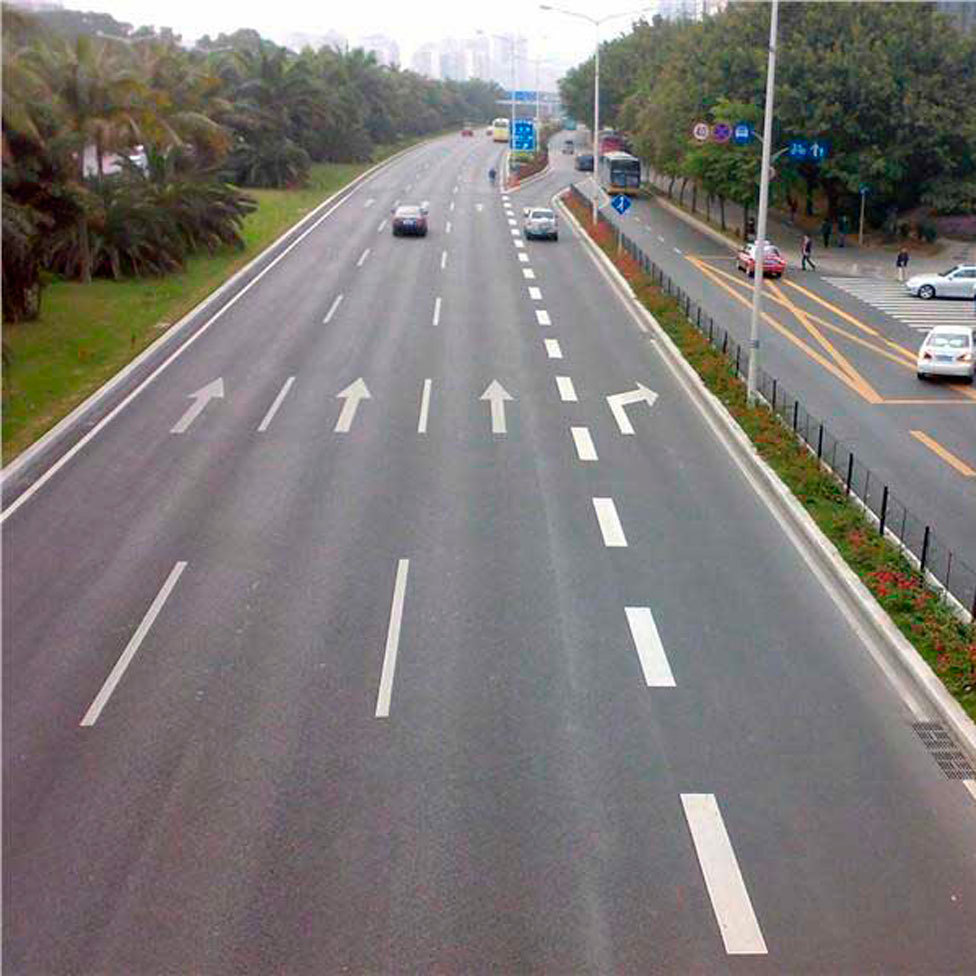
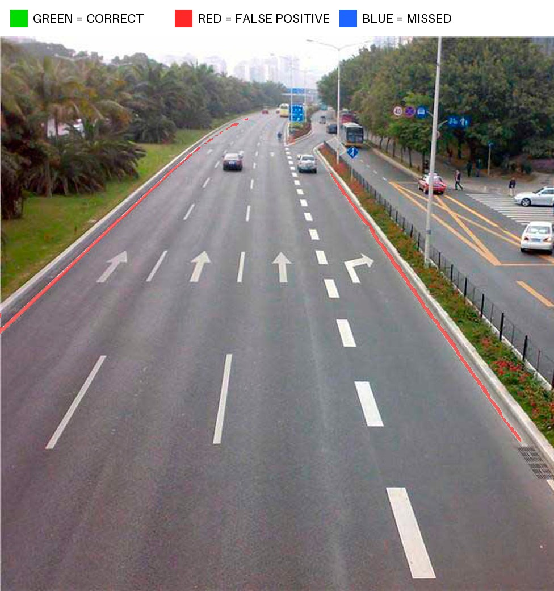
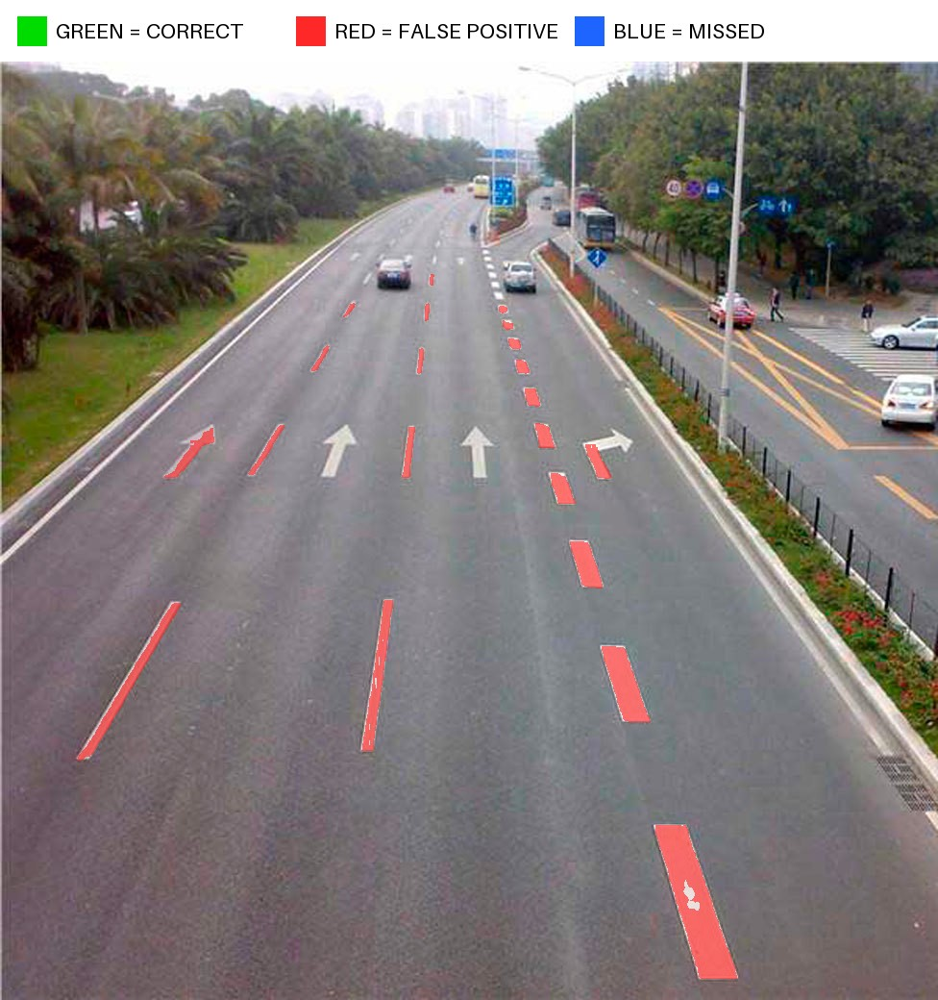
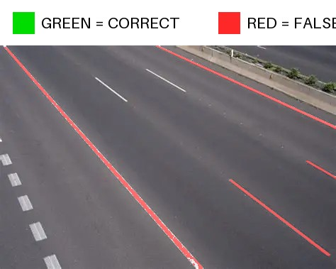
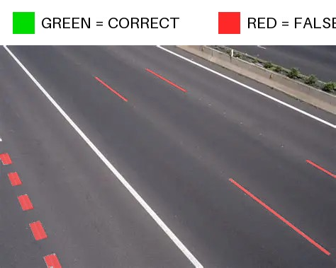
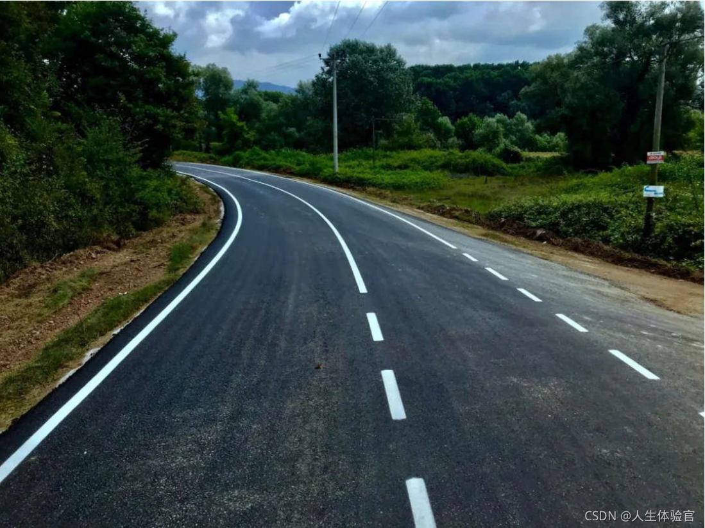
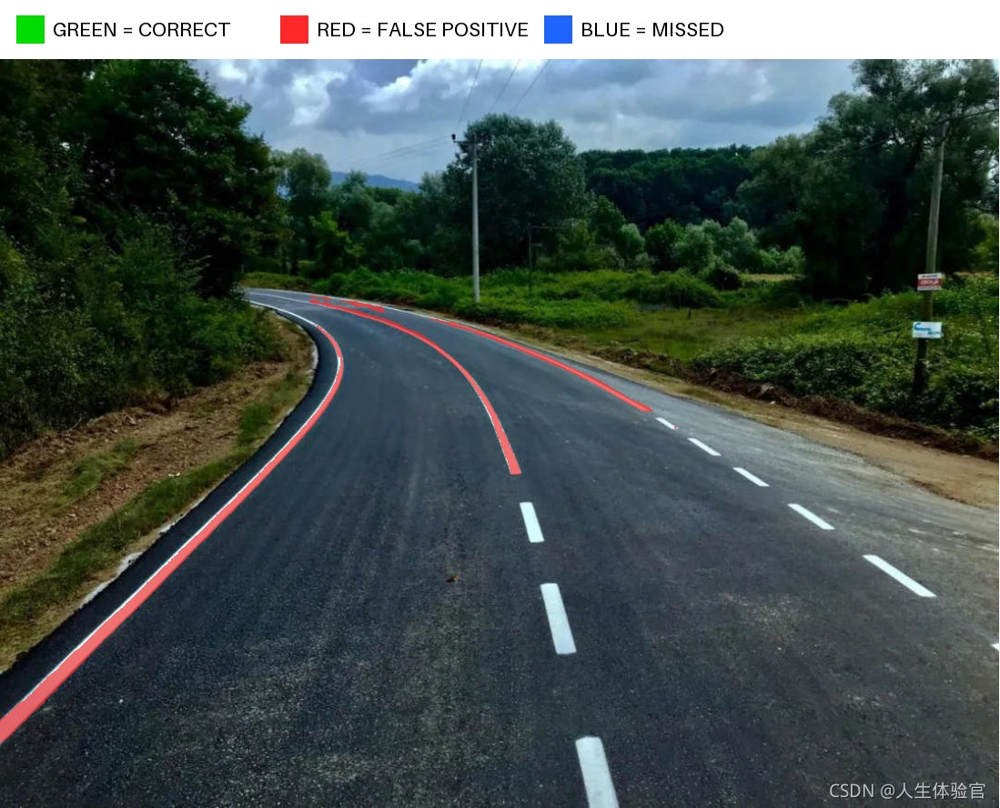
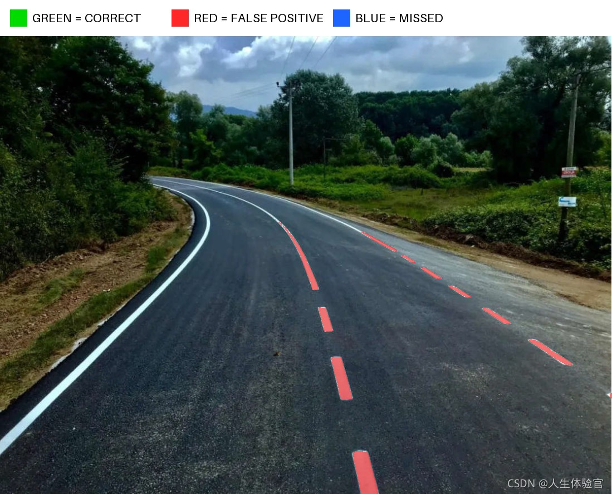

# SAM3模块化、LoRA微调与轻量化蒸馏实验总览

本仓库围绕SAM3开展三部分连续工作：首先拆分并重组原始SAM3，建立可独立训练和替换模块的工程结构；随后在模块化Base DETR上完成道路标线LoRA微调；最后以成功微调的Base模型为能力上限和教师，探索EfficientViT、TinyViT及蒸馏方案。

因此，本项目不是单一的轻量化实验。SAM3模块化和Base DETR LoRA微调本身就是已经完成的核心成果，轻量化与蒸馏是建立在它们之上的后续研究。五个实验目录按实际发生顺序形成如下路线：

```text
0. SAM3 Base模块化与DETR LoRA
   ├── 把完整SAM3拆成可独立加载和重组的功能模块
   ├── 在模块化DETR上完成道路标线LoRA微调
   └── 后续回溯跳接：第5步关闭域外纯负提示，恢复开放类别并刷新Base上限
   ↓
1. 早期TinyViT-S：验证轻量模型、固定词表和LoRA训练链路
   ↓
2. EfficientViT Stage-3直接LoRA：使用作者更新的官方轻量模型完整训练
   ↓ 效果仍明显低于Base
3. EfficientViT Stage-3 P0蒸馏：尝试用Base最终输出监督学生
   ↓ 验证loss未持续改善，当前方案又没有训练图像编码器
4. 切换到TinyViT Stage-3蒸馏主线
   P0 最终输出KD
    ↓
   P1 增加三尺度图像特征KD
    ↓
   P2 图像LoRA从Stage 2/3扩展到Stage 1/2/3
    ↓
   P3 图像与DETR LoRA统一从r8提高到r16（已完成，实际增益不明显）
    ↓
   P4 从P2同一起点对比“继续LoRA训练”与“完整解冻Stage 3 + neck”
    ↓ 解冻无效，回到P2并改造细线视觉结构
   P5 冻结P2，增加Stage 2 DSConv细线分支
    ↓
   P6 冻结P5，增加Stage 1 DSConv细线分支
    ↓
   P7 冻结P6，把方向特征直连288/144分辨率FPN
    ↓
   P8 冻结P7，从1008原图经无损PixelUnshuffle后提取504分辨率细线特征（完成5轮）
   ↓
5. 回到Base做域外负提示消融：保留内部负提示，只关闭person/dog/cat等纯负提示
   └── car从0恢复到20，平均IoU从旧教师0.7021提高到0.7483
```

下面按真实实验先后说明每一步的独立目标、训练基础、结果，以及它与后续实验的关系。详细命令、代码结构和完整指标放在对应实验目录的README中。

## 0. SAM3 Base模块化与DETR LoRA

对应目录：[sam3_detr_exp](sam3_detr_exp/README.md)

这是项目最早的主实验，本身包含两个连续且都已成功的阶段，并不是为了蒸馏临时建立的对照组。

### 0.1 SAM3模块拆分

- 起点：原始完整`sam3.pt`。
- 目标：把大checkpoint拆成视觉骨干、文本编码器、Transformer Encoder/Decoder、分割头、几何编码器、点积分类头和跟踪器等10个模块。
- 测试：分别重组detector、tracker和video predictor，并对比原始模型与模块化模型的图像、视频推理链路。
- 结论：模块拆分、独立加载和重新组装成功，模块化推理链路可用；这为后续只训练或替换DETR等局部模块建立了工程基础。

### 0.2 SAM3 DETR LoRA微调

- 起点：0.1导出的SAM3 Base模块化权重。
- 改动：在DETR Encoder/Decoder挂载r8 LoRA，同时训练点积分类头和分割头；图像与文本骨干保持冻结。
- 训练：日志显示完成8轮验证（epoch 0～7），epoch 8未完成；最佳验证loss出现在epoch 4。现有记录没有注明提前停止原因。
- 统一10图结果：白实线IoU/Recall为0.7235/0.7883，白虚线为0.6808/0.8226，两类平均IoU为0.7021。
- 结论：SAM3 DETR LoRA道路标线微调成功。在不训练Base图像与文本骨干的情况下，模型获得了很强的道路标线文本提示分割能力。该最佳权重随后才被复用为轻量化实验的效果上限和蒸馏教师。

> 后续回溯跳接：时间上在TinyViT P8之后完成的[域外负提示消融](sam3_detr_exp/negative_prompt_ablation/README.md)
> 证明，保留道路标线内部负提示、只关闭没有正样本配对的域外纯负提示后，Base平均IoU由旧教师
> 的0.7021提高到0.7483，且`car`检测由0恢复到20。历史章节仍按实际顺序保留，完整结果见第5步。

## 1. 早期TinyViT-S可行性实验

对应目录：[sam3_lightweight_exp](sam3_lightweight_exp/README.md)

- 起点：早期`efficient_sam3_tinyvit_s.pt`。
- 改动：将大文本编码器替换为预提取固定词表；训练DETR r8 LoRA、点积分类头和分割头。
- 训练：原计划3轮，只完成epoch 0便主动停止；验证loss为9.3882。
- 测试：没有计算统一IoU/Recall，只记录阈值0.5下白实线77个、白虚线49个检测，平均置信度分别为0.5956和0.6141。
- 结论：证明了固定提示轻量部署与LoRA训练链路可行，但单轮结果不能参与正式效果排名。
- 为什么继续下一步：作者随后发布了更完整的Stage-3轻量模型，因此不再围绕这份早期权重继续训练。

## 2. EfficientViT Stage-3直接LoRA

对应目录：[sam3_lightweight_stage3_exp](sam3_lightweight_stage3_exp/README.md)

- 起点：作者官方Stage-3 EV-M，即EfficientViT-B1图像编码器和MobileCLIP-S0文本编码器。
- 改动：冻结图像和文本编码器；训练DETR r8 LoRA、点积分类头和分割头。
- 训练：完整完成20轮（epoch 0～19），没有提前停止；最佳验证loss为epoch 10的7.1777。
- 统一10图结果：白实线IoU/Recall为0.3905/0.5137，白虚线为0.2153/0.2403，两类平均IoU为0.3029。
- 结论：完整训练后仍明显低于Base，白虚线召回差距最大。
- 为什么继续下一步：直接LoRA不足，因此尝试用Base教师提供分类、presence、框和mask软目标。

## 3. EfficientViT Stage-3 P0输出蒸馏

对应目录：[sam3_lightweight_stage3_distill_exp](sam3_lightweight_stage3_distill_exp/README.md)

- 学生起点：第2步的EfficientViT Stage-3最佳LoRA。
- 教师：第0步的Base + DETR最佳LoRA。
- 改动：保留真实标签监督，增加最终层分类、presence、框和低分辨率mask KD；学生仍只训练DETR r8 LoRA和两个输出头。
- 训练：计划10轮，完成8轮验证（epoch 0～7），epoch 8未完成后主动停止；最低验证loss为epoch 1的11.1575，之后没有持续改善。
- 测试：当前目录没有保留可复核的统一10图IoU/Recall，因此不能量化相对第2步的实际收益。
- 结论：输出蒸馏链路能够训练，但现有证据不能证明它优于未蒸馏的EfficientViT Stage-3。
- 为什么转向TinyViT：这次EfficientViT方案冻结图像编码器、只调整DETR，无法充分弥补视觉表征差距；EfficientViT又包含较多卷积结构，不能直接照搬面向attention/MLP线性层的图像LoRA方案，因此改用官方TinyViT Stage-3继续验证图像侧LoRA。

## 4. TinyViT Stage-3连续蒸馏主线

总目录：[sam3_lightweight_tinyvit_stage3_distill_exp](sam3_lightweight_tinyvit_stage3_distill_exp/README.md)

这一阶段包含两段有明确分叉点的连续实验。P0～P3逐步扩大蒸馏和LoRA；P4从P2做严格解冻对照。P4无效后，P5同样回到P2，转而验证细线专用视觉结构；P6～P8再从各自上一阶段实际IoU最佳权重继续：

```text
官方TinyViT Stage-3 + 兼容的Stage-3 DETR/输出头
  → P0最佳
  → P1从P0最佳继续
  → P2从P1最佳继续
  → P3从P2最佳转换并继续
  ├→ P4从P2最佳做Control/完整解冻对照（无效，停止）
  └→ P5从P2最佳增加Stage 2 DSConv
       → P6从P5任务最佳增加Stage 1 DSConv
       → P7从P6任务最佳直连高/中分辨率FPN
       → P8从P7任务最佳增加输入侧504分辨率细线分支（完成5轮，epoch 4任务最佳）
  → P9回到官方TinyViT起点，一次挂载P8完整结构并改用无域外负提示的新Base教师（完成20轮）
```

### 4.1 P0：最终输出KD与图像LoRA

- 位置：[实验根目录](sam3_lightweight_tinyvit_stage3_distill_exp/README.md)
- 起点：官方TinyViT Stage-3图像骨干；兼容的DETR和输出头继承Stage-3学生LoRA；教师仍为Base最佳LoRA。
- 改动：TinyViT Stage 2/3图像r8 LoRA、DETR r8 LoRA、两个输出头，加最终输出KD。
- 训练：计划10轮，完成7轮（epoch 0～6）后主动停止；最佳点为epoch 6，验证loss为10.0117。
- 结果：白实线IoU/Recall为0.5187/0.6676，白虚线为0.3400/0.4139，平均IoU为0.4293。
- 结论：明显超过EfficientViT Stage-3，但仍远低于Base，因此下一步直接蒸馏图像特征。

### 4.2 P1：增加三尺度图像特征KD

- 位置：[p1_image_feature](sam3_lightweight_tinyvit_stage3_distill_exp/p1_image_feature/README.md)
- 起点：P0最佳权重。
- 改动：保留P0全部训练项，增加三尺度FPN图像特征KD；图像LoRA仍只覆盖Stage 2/3。
- 训练：计划10轮，完成7轮（epoch 0～6）后主动停止；最佳点为epoch 6，验证loss为10.2271。
- 结果：白实线IoU/Recall为0.5343/0.6863，白虚线为0.3490/0.4279，平均IoU为0.4417。
- 结论：相对P0平均IoU提高0.0124，证明图像特征蒸馏有效，但提升较小，因此下一步扩大图像LoRA覆盖范围。

### 4.3 P2：图像LoRA扩展到Stage 1/2/3

- 位置：[p2_image_stage123](sam3_lightweight_tinyvit_stage3_distill_exp/p2_image_stage123/README.md)
- 起点：P1最佳权重。
- 改动：保持蒸馏损失不变，把图像r8 LoRA从Stage 2/3扩展到Stage 1/2/3。
- 训练：计划10轮，完成6轮（epoch 0～5）后主动停止；最佳点为epoch 5，验证loss为10.1169。
- 结果：白实线IoU/Recall为0.5454/0.7145，白虚线为0.3652/0.4461，平均IoU为0.4553。
- 结论：相对P1平均IoU提高0.0136，是P3之前的最佳轻量结果，但仍没有质的飞跃。由于P2从P1继续训练，收益不能完全归因于新增Stage 1 LoRA。

### 4.4 P3：图像与DETR LoRA统一提高到r16

- 位置：[p3_all_r16](sam3_lightweight_tinyvit_stage3_distill_exp/p3_all_r16/README.md)
- 起点：P2最佳权重。
- 改动：先把P2图像与DETR的r8增量合并进对应基础权重，再给TinyViT Stage 1/2/3和DETR Encoder/Decoder统一挂载零增量r16、alpha32 LoRA；输出头和蒸馏损失不变。
- 验证：已合并并重新挂载40个图像LoRA模块和84个DETR LoRA模块；转换前后单图白实线IoU为0.5373→0.5334，白虚线为0.3978→0.3989。单步训练/验证通过，DETR、图像和输出头梯度均非零。
- 参数量：总参数105,844,922，可训练参数5,792,001。
- 训练：完整完成10轮（epoch 0～9），最佳点为epoch 3；`val/loss=10.0335`、`val/supervised=5.9835`、图像特征KD为0.3315。epoch 3之后进入波动平台。
- 结果：白实线IoU/Recall为0.5487/0.7228，白虚线为0.3639/0.4452，平均IoU为0.4563。
- 结论：相对P2平均IoU只提高0.0010；白实线略升，但白虚线IoU和Recall略降。统一r16能降低训练loss，却没有形成有意义的实际效果提升，说明当前主要瓶颈不是LoRA秩。

### 4.5 P4：完整解冻Stage 3与neck严格对照

- 位置：[p4_unfreeze_stage3_neck](sam3_lightweight_tinyvit_stage3_distill_exp/p4_unfreeze_stage3_neck/README.md)
- 共同起点：P2最佳权重，不从P3继续，避免引入无明显收益的r16变量。
- Control：保持P2结构和r8 LoRA，继续训练3轮。
- Unfreeze：合并并移除Stage 3的8个图像LoRA，完整解冻Stage 3与FPN neck；Stage 1/2图像r8 LoRA、DETR r8 LoRA和输出头保持不变，同样训练3轮。
- 参数量：Control可训练4,636,929；Unfreeze可训练17,164,125，其中Stage 3为4,839,772，neck为7,802,112。
- 训练：两组均完整训练3轮（epoch 0～2），并逐轮完成相同10图、7提示、阈值0.5的统一评测。
- 结果：Control最佳为epoch 0，白实线IoU/Recall为0.5411/0.7200，白虚线为0.3680/0.4550，平均IoU为0.4546；Unfreeze最佳为epoch 1，对应0.5180/0.6801和0.3664/0.4652，平均IoU为0.4422。Unfreeze epoch 2又降至0.4395。
- 判定门槛：相对Control平均IoU至少提高0.01，或白虚线Recall至少提高0.02，且负类误检不能明显增加。
- 结论：Unfreeze平均IoU反而下降0.0124，白虚线Recall只提高0.0102，未达到门槛。尽管最低验证loss由10.1254降至9.9673，任务指标没有受益，因此P4判定无效，不继续追加轮数。

### 4.6 P5：Stage 2 DSConv细线分支

- 位置：[p5_dsconv_thin_line](sam3_lightweight_tinyvit_stage3_distill_exp/p5_dsconv_thin_line/README.md)
- 起点：P2最佳权重，不从P3或P4继续；保留并冻结P2全部LoRA和旧参数。
- 改动：只训练新增Stage 2水平/垂直DSConv、偏移预测、融合投影和残差门控，共新增896,019个可训练参数。
- 训练：完整完成20轮（epoch 0～19），最低验证loss与最佳任务指标都在epoch 15；`val/loss=9.5198`、`val/supervised=5.5815`。
- 结果：白实线IoU/Recall为0.5746/0.7308，白虚线IoU/Recall为0.4967/0.5957，平均IoU为0.5357，比P2提高0.0804。
- 结论：冻结P2后，高分辨率细线旁路带来显著增益，尤其改善白虚线；但P5-B普通长条卷积对照尚未执行，因此不能把全部收益严格归因于动态蛇形偏移。

### 4.7 P6：增加Stage 1 DSConv分支

- 位置：[p6_multiscale_dsconv](sam3_lightweight_tinyvit_stage3_distill_exp/p6_multiscale_dsconv/README.md)
- 起点：P5 epoch 15任务最佳权重；冻结P5和此前全部参数。
- 改动：新增Stage 1水平/垂直DSConv细线分支，只训练新增301,587个参数。
- 训练：完整完成10轮（epoch 0～9）；任务指标最佳为epoch 8，最低验证loss在epoch 9。epoch 8的`val/loss=9.3122`、`val/supervised=5.4088`。
- 结果：白实线IoU/Recall为0.6214/0.7486，白虚线IoU/Recall为0.5610/0.6524，平均IoU为0.5912，比P5提高0.0555。
- 结论：更早、更高分辨率的Stage 1方向特征具有明确增量；epoch 8～9已经进入平台，因此没有追加到20轮。

### 4.8 P7：方向特征直连高/中分辨率FPN

- 位置：[p7_highres_fpn](sam3_lightweight_tinyvit_stage3_distill_exp/p7_highres_fpn/README.md)
- 起点：P6 epoch 8任务最佳权重；冻结P6和此前全部参数。
- 改动：复用P6方向特征，新增到`288×288`与`144×144` FPN的直接适配器和标量门控，只训练99,330个新参数。
- 训练：完整完成10轮（epoch 0～9），任务指标最佳为epoch 9；`val/loss=9.2771`、`val/supervised=5.3814`。
- 结果：白实线IoU/Recall为0.6319/0.7603，白虚线IoU/Recall为0.5687/0.6604，平均IoU为0.6003，比P6提高0.0091。
- 结论：有稳定小幅收益，但未达到预设0.6112门槛。最终高分辨率门控`gate_high=-0.0171`、中分辨率门控`gate_mid=0.7620`，说明模型主要采用Stage 2到`144×144`的直连，而不是对已编码Stage 1特征插值到`288×288`。

### 4.9 P8：输入侧504分辨率细线分支

- 位置：[p8_input_line_branch](sam3_lightweight_tinyvit_stage3_distill_exp/p8_input_line_branch/README.md)
- 起点：P7 epoch 9任务最佳权重；冻结P7和此前全部参数。
- 改动：将`1008×1008` RGB输入通过`PixelUnshuffle(2)`无损重排为`12×504×504`，先用水平/垂直DSConv提取原图侧细线特征，再融合到`288×288` FPN；只训练83,827个新参数。
- 训练：完整完成5轮（epoch 0～4），并逐轮完成相同10图、7提示、阈值0.5的统一评测；验证loss和任务IoU均持续改善，任务最佳为epoch 4。
- 最终结果：白实线IoU/Recall为0.6772/0.7900，白虚线IoU/Recall为0.5960/0.6883，平均IoU为0.6366，比P7提高0.0363，比P8 epoch 0提高0.0210。
- 结论：输入侧真正的504分辨率细线提取有效，且5轮内尚未出现任务指标回退；但相对Base + DETR LoRA的平均IoU 0.7021仍差0.0655。DSConv与普通长条卷积的严格对照仍未完成。

## 5. Base域外负提示回溯消融

对应目录：[negative_prompt_ablation](sam3_detr_exp/negative_prompt_ablation/README.md)

该实验实际发生在TinyViT P8之后，因此放在第5步；第0步Base章节只保留跳接，不把后来的发现倒插
进早期时间线。实验从原始Base模块化权重重新训练，与历史20轮多提示模型保持数据、全部7个道路
标线提示、内部空目标负提示、SAM3 loss、DETR r8 LoRA、两个训练头和优化参数一致，只通过
`--num-generic-negatives 0`关闭每图额外采样的域外纯负提示。

- 训练：完整20轮，epoch 13最佳`val/loss=4.1741`；历史含域外负提示20轮最佳为4.2201。
- 道路标线：白实线IoU/Recall为0.7520/0.8608，白虚线为0.7445/0.8423，平均IoU为0.7483。
- 跨类别：固定同图、`car`、阈值0.5下检测20个；旧正式教师检测0个。
- 结论：域外纯负提示既不是专项收敛所必需，还会破坏开放类别泛化。保留道路标线内部负提示、
  SAM3 Presence和多提示训练本身是可行的；今后正式训练默认关闭无正样本配对的域外负提示。

### 5.1 与开源SAM3_LoRA的同口径验证loss复核

为判断开源项目[SAM3_LoRA](https://github.com/Sompote/SAM3_LoRA)记录的较低验证loss是否代表
更强的Base模型，使用其`outputs/roadline_lora/best_lora_weights.pt`进行了完整复核。模型加载、
SAM3原生loss和验证数据保持该项目实现不变，只把验证提示改为本项目的固定7个道路标线类别，
并关闭每图额外2个随机域外负提示。测试使用4卡、每卡图片batch 2，覆盖2343张验证图片、
62193个标注，共1172个验证batch。

| 模型与验证口径 | `val_loss` |
|---|---:|
| SAM3_LoRA原始记录：7类道路标线 + 每图2个域外负提示 | 3.674239 |
| 同一SAM3_LoRA最佳权重：固定7类、无域外负提示 | 4.260781 |
| 本项目Base回溯消融：固定7类、无域外负提示 | 4.174067 |

同一SAM3_LoRA权重移除域外负提示后，验证loss上升0.586542（约13.8%）。这证明原始`3.674239`
受到容易域外负样本参与分类和Presence平均的明显影响，不能直接与本项目固定7提示的loss比较。
统一口径后，SAM3_LoRA为4.260781，本项目Base为4.174067；本项目低0.086714（约2.1%）。因此，
当前证据不支持“SAM3_LoRA优于本项目Base”的判断；只按最终同口径验证loss，本项目Base略优，
但两者差距不大。

## 6. P9：原始TinyViT、P8完整结构与新教师从头蒸馏

- 位置：[p9_fresh_p8_new_teacher](sam3_lightweight_tinyvit_stage3_distill_exp/p9_fresh_p8_new_teacher/README.md)
- 起点：作者官方TinyViT Stage-3，不继承P0～P8任何学生LoRA、输出头或细线分支训练权重。
- 结构：从训练开始一次性挂载P5～P8完整细线结构，并训练Stage 1/2/3图像LoRA、DETR LoRA、两个输出头和全部新增分支。
- 教师：使用第5步无域外负提示的新Base权重，统一10图平均IoU为0.7483且`car`恢复到20。
- 负提示：教师缓存和学生训练均关闭域外纯负提示，只保留7类道路标线之间的数据集内负提示。
- 训练：四卡完整完成20轮，epoch 19最低`val/loss=8.5787`、`val/supervised=4.8604`。
- 道路标线：白实线IoU/Recall为0.6284/0.6869，白虚线为0.6595/0.7543，平均IoU为0.6439；
  比P8提高0.0074，但仍比新Base教师低0.1043，未达到0.68验收线。
- 开放类别：固定首图`car`检测15个，10图合计185个；人工检查mask确实覆盖车辆，说明开放类别
  能力没有再次丢失，但首图仍低于新Base教师的20个。

## 统一结果对比

统一结果使用相同10张道路图片、相同文本提示和置信度阈值0.5。测试集只有白实线和白虚线真值，其他类别只能观察误检。

| 阶段 | 所属目录 | 白实线IoU | 白实线Recall | 白虚线IoU | 白虚线Recall | 平均IoU |
|---|---|---:|---:|---:|---:|---:|
| Base + DETR LoRA | [sam3_detr_exp](sam3_detr_exp/README.md) | 0.7235 | 0.7883 | 0.6808 | 0.8226 | 0.7021 |
| Base回溯消融：无域外负提示 | [negative_prompt_ablation](sam3_detr_exp/negative_prompt_ablation/README.md) | 0.7520 | 0.8608 | 0.7445 | 0.8423 | 0.7483 |
| EfficientViT Stage-3 LoRA | [sam3_lightweight_stage3_exp](sam3_lightweight_stage3_exp/README.md) | 0.3905 | 0.5137 | 0.2153 | 0.2403 | 0.3029 |
| TinyViT P0 | [TinyViT实验根目录](sam3_lightweight_tinyvit_stage3_distill_exp/README.md) | 0.5187 | 0.6676 | 0.3400 | 0.4139 | 0.4293 |
| TinyViT P1 | [p1_image_feature](sam3_lightweight_tinyvit_stage3_distill_exp/p1_image_feature/README.md) | 0.5343 | 0.6863 | 0.3490 | 0.4279 | 0.4417 |
| TinyViT P2 | [p2_image_stage123](sam3_lightweight_tinyvit_stage3_distill_exp/p2_image_stage123/README.md) | 0.5454 | 0.7145 | 0.3652 | 0.4461 | 0.4553 |
| TinyViT P3全r16 | [p3_all_r16](sam3_lightweight_tinyvit_stage3_distill_exp/p3_all_r16/README.md) | 0.5487 | 0.7228 | 0.3639 | 0.4452 | 0.4563 |
| P4 Control最佳 | [p4_unfreeze_stage3_neck](sam3_lightweight_tinyvit_stage3_distill_exp/p4_unfreeze_stage3_neck/README.md) | 0.5411 | 0.7200 | 0.3680 | 0.4550 | 0.4546 |
| P4解冻最佳 | [p4_unfreeze_stage3_neck](sam3_lightweight_tinyvit_stage3_distill_exp/p4_unfreeze_stage3_neck/README.md) | 0.5180 | 0.6801 | 0.3664 | 0.4652 | 0.4422 |
| TinyViT P5（epoch 15） | [p5_dsconv_thin_line](sam3_lightweight_tinyvit_stage3_distill_exp/p5_dsconv_thin_line/README.md) | 0.5746 | 0.7308 | 0.4967 | 0.5957 | 0.5357 |
| TinyViT P6（epoch 8） | [p6_multiscale_dsconv](sam3_lightweight_tinyvit_stage3_distill_exp/p6_multiscale_dsconv/README.md) | 0.6214 | 0.7486 | 0.5610 | 0.6524 | 0.5912 |
| TinyViT P7（epoch 9） | [p7_highres_fpn](sam3_lightweight_tinyvit_stage3_distill_exp/p7_highres_fpn/README.md) | 0.6319 | 0.7603 | 0.5687 | 0.6604 | 0.6003 |
| TinyViT P8（epoch 4，正式最佳） | [p8_input_line_branch](sam3_lightweight_tinyvit_stage3_distill_exp/p8_input_line_branch/README.md) | 0.6772 | 0.7900 | 0.5960 | 0.6883 | 0.6366 |
| TinyViT P9（epoch 19，新教师从头蒸馏） | [p9_fresh_p8_new_teacher](sam3_lightweight_tinyvit_stage3_distill_exp/p9_fresh_p8_new_teacher/README.md) | 0.6284 | 0.6869 | 0.6595 | 0.7543 | 0.6439 |

早期TinyViT-S和EfficientViT P0蒸馏没有可复核的统一IoU/Recall，因此不放入数值排名。不同阶段的loss组成不同，跨实验应比较上表的实际IoU和Recall，不能直接比较`val/loss`。

## 泛化能力专项检查

### 跨类别开放词汇泛化：已定位并在Base回溯实验中恢复

在固定道路图`DJI_20251231162942_0002_V_frame_001.png`上使用文本提示`car`、阈值0.5进行同图检查。画面中存在大量清晰车辆：

| 模型或权重 | `car`检测数 | 说明 |
|---|---:|---|
| 官方EfficientViT Stage-3 | 11 | 微调前通用能力正常 |
| 官方TinyViT Stage-3 | 10 | 微调前通用能力正常 |
| Base早期`detr_lora.pt` | 11 | 早期微调仍保留开放类别能力 |
| Base早期`roadline_sam3_loss_lora.best.pt` | 20 | 早期SAM3-loss版本仍能检测车辆 |
| 当前正式Base教师`roadline_r8_a16_lr2e4.best.pt` | 0 | 正式多提示道路标线训练后已丢失`car` |
| Base回溯消融：无域外负提示 | 20 | 保留内部负提示，只关闭域外纯负提示后恢复 |
| EfficientViT道路标线最佳权重 | 0 | TinyViT P0继承它的DETR LoRA与输出头时，能力已经丢失 |
| TinyViT P2 / P7 / P8 | 0 / 0 / 0 | P2在阈值降到0.1后仍为0，P5～P8不是首次发生退化的位置 |
| TinyViT P9新教师从头蒸馏 | 15 | 10图合计185个，人工检查首图mask确实覆盖车辆；泛化已恢复但尚未追平新Base教师 |

回溯消融已经把主要原因从宽泛的“专项训练链路”收窄到域外纯负提示：新实验仍保留全部7个道路
标线提示、数据集内部空目标、SAM3 Presence loss以及点积分类头和分割头训练，只移除每图2个
`person/dog/cat...`域外负提示，`car`便从0恢复到20。因此不能把退化归因于TinyViT、P8、
Presence或多提示机制本身。轻量化P0～P8继承的是已经退化的教师/学生输出体系，所以其开放类别
能力不会自动恢复；P9改用无域外负提示的新Base教师并从官方TinyViT重新蒸馏后，`car`首图恢复
到15个、10图合计185个，进一步验证教师与训练提示构造会直接影响学生的开放类别能力。

### 同类别跨形态泛化：道路标线能力成功保留

使用3张未参与训练的网络图片检查城市多车道、乡村弯道和低分辨率斜视场景。测试权重为P8 epoch 4，提示为`white solid lane line`和`white dashed lane line`，阈值0.5。图片没有人工标注，因此这里只报告检测数量并人工检查mask，不计算IoU。

| 场景 | 白实线检测数 | 白虚线检测数 | 人工检查结论 |
|---|---:|---:|---|
| 城市多车道、远距离、箭头干扰 | 2 | 21 | 远处小虚线和连续边线能够检出；部分方向箭头被虚线提示误检 |
| 低分辨率斜视道路 | 4 | 9 | 斜向实线、短虚线和左侧块状虚线均能检出 |
| 乡村弯道 | 4 | 11 | 连续边线能跟随弯曲形态，中心虚线保持分段 |
| 合计 | 10 | 41 | 城市/乡村、直线/曲线、远景/近景和低分辨率形态均有响应 |

P7和P8在这3张图上的逐图检测数及平均/最高置信度完全一致，都是实线10个、虚线41个；P8主要轻微调整分割mask边界，没有破坏P7的同类别跨形态检出能力。正式Base对应实线12个、虚线52个，候选更多，但没有真值时不能把更多候选直接解释为更高精度。

图示中的红色表示“没有真值可匹配的预测覆盖区域”，不表示这些mask经过人工确认都是误检。原图来源分别为[阿里图片](https://i00.c.aliimg.com/img/ibank/2014/993/659/1557956399_406316771.jpg)、[CSDN图片](https://img-blog.csdnimg.cn/576b4ff07bd748b8b535863b6a158118.png)和[Bing图片](https://tse1.mm.bing.net/th/id/OIP.W_4BdBKB8Fm6GwCekV6z9AHaE7)。仓库内文件统一保存在[跨形态泛化图示目录](assets/experiments/roadline_cross_shape_generalization/)。

| 场景 | 网络来源图 | P8白实线结果 | P8白虚线结果 |
|---|---|---|---|
| 城市多车道 |  |  |  |
| 低分辨率斜视 |  |  |  |
| 乡村弯道 |  |  |  |

## 五个实验目录的职责

| 目录 | 在路线中的位置 |
|---|---|
| [sam3_detr_exp](sam3_detr_exp/README.md) | 第0步完成模块拆分与DETR LoRA；第5步在其子目录回溯完成域外负提示消融 |
| [sam3_lightweight_exp](sam3_lightweight_exp/README.md) | 第1步：早期轻量化可行性验证 |
| [sam3_lightweight_stage3_exp](sam3_lightweight_stage3_exp/README.md) | 第2步：EfficientViT Stage-3直接LoRA基线 |
| [sam3_lightweight_stage3_distill_exp](sam3_lightweight_stage3_distill_exp/README.md) | 第3步：EfficientViT最终输出蒸馏 |
| [sam3_lightweight_tinyvit_stage3_distill_exp](sam3_lightweight_tinyvit_stage3_distill_exp/README.md) | 第4、6步：TinyViT P0～P8连续结构实验，以及P9新教师从头蒸馏 |

## 当前结论与下一步

- 项目早期已经成功完成SAM3模块拆分、重组验证和Base DETR LoRA道路标线微调；轻量化实验建立在这一成功结果上。
- Base回溯消融把当前效果上限从旧教师平均IoU 0.7021刷新到0.7483；轻量模型的差距因此重新扩大。
- EfficientViT路线完整训练后效果不足，输出蒸馏也没有形成可量化改善，因此已经转向TinyViT。
- TinyViT的最终输出KD、图像特征KD和扩大图像LoRA覆盖范围带来了连续小幅提升，但尚未接近Base。
- P3把图像和DETR LoRA统一提高到r16后，平均IoU只比P2增加0.0010，白虚线指标反而略降；继续提高LoRA秩不再是优先路线。
- 按平均IoU数值P3为0.4563、略高于P2的0.4553，但差异很小，不能视为质变。
- P4严格对照已经完成：完整解冻Stage 3与neck后最佳平均IoU为0.4422，低于同起点Control的0.4546。验证loss虽下降，实际任务指标反而变差，因此该方向判定无效。
- 当前不建议继续提高LoRA秩、延长P4训练或扩大解冻范围。
- P5在冻结P2的条件下增加Stage 2 DSConv分支，平均IoU达到0.5357；P6冻结P5并增加Stage 1 DSConv，达到0.5912；P7冻结P6并把方向特征直连高/中分辨率FPN，达到0.6003。这条结构改造路线的收益明显大于提高LoRA秩或完整解冻。
- P8进一步从输入侧504分辨率先提取细线再下采样，5轮任务指标单调提升；epoch 4平均IoU达到0.6366，比P7提高0.0363，确认为正式任务最佳权重。
- P9从官方TinyViT与P8完整结构重新开始，改用无域外负提示的新Base教师完整蒸馏20轮；平均IoU为0.6439，只比P8提高0.0074，主要收益集中在白虚线，尚未缩小到接近Base的程度。
- P7最终主要采用Stage 2到`144×144`的中分辨率直连，而P8完整5轮进一步证明输入侧高分辨率特征具有价值。普通长条卷积严格对照尚未完成，因此目前只能确认高分辨率细线旁路有效，不能确认动态蛇形采样具有独立收益。
- 泛化检查必须区分两个维度：旧正式Base教师和轻量化P0～P8丢失了`car`开放词汇能力；Base回溯消融关闭域外纯负提示后恢复到20个，P9使用该新教师从头蒸馏后恢复到15个。P8对3张网络域外道路图仍保留了道路标线类别内部的跨形态泛化。
- 原始SAM3支持负查询与Presence训练，但“每图再随机加入2个`person/dog/cat...`通用词作为纯负提示”来自外部`SAM3_LoRA`项目的自定义策略。严格单变量回溯已经验证：关闭这些域外纯负提示后，`car`由0恢复到20且平均IoU提高到0.7483，因此该策略是当前已确认的退化主因。完整证据与后续泛化测试见[多提示负训练专项TODO](sam3_detr_exp/docs/multi-prompt-negative-training-todo.md)。

## 环境与目录约束

当前运行环境以仓库内`.venv`和根目录[requirements.txt](requirements.txt)为准。根README只记录路线和横向结果；模型结构、下载、训练命令、日志与完整测试说明放在对应实验目录。缓存、权重、日志和`tests/output`不提交Git。

## 模型体积与部署导出

以Base图像模型FP32张量3245.05 MiB为相同口径，EfficientViT Stage-3合并后为371.76 MiB，缩小
8.73倍；当前TinyViT P8合并后为400.31 MiB FP32或约200.16 MiB FP16，均相对同精度Base缩小
8.11倍、减少87.66%。固定道路标线词表并移除MobileCLIP后，P8预计约119 MiB FP16，但不再支持
运行时任意文本。当前469.98 MiB基模和139.00 MiB P8 checkpoint包含重复权重，不能直接相加作为
最终模型大小。完整计算口径、各阶段压缩率、可合并模块和正式导出TODO见
[轻量模型体积、权重合并与最终推理包分析](sam3_lightweight_tinyvit_stage3_distill_exp/模型体积与合并分析.md)。
