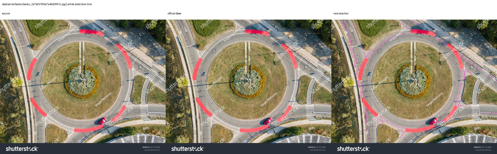
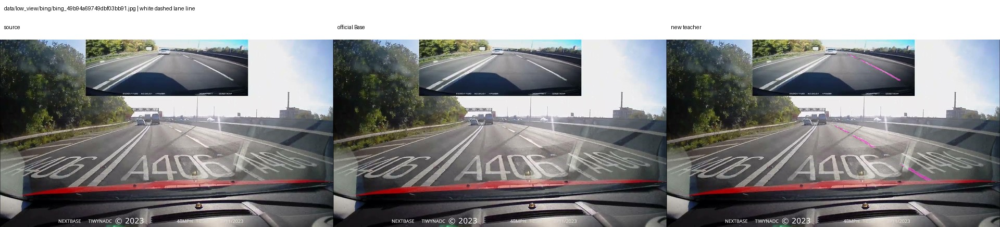
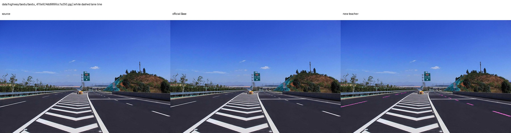
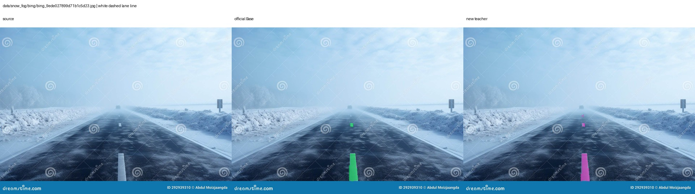
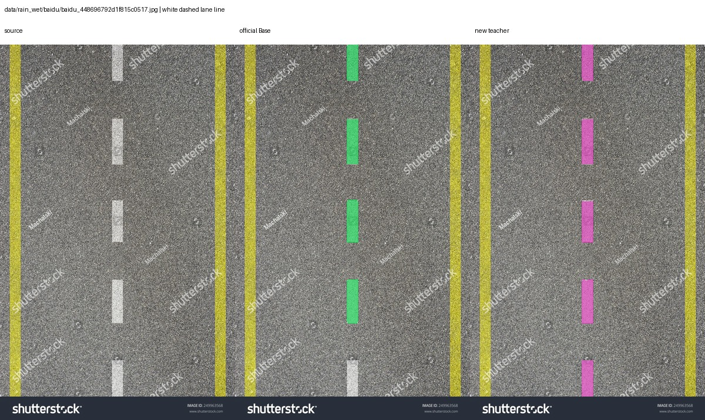

# 把SAM3道路标线能力做强、再做小：微调保泛化与轻量化蒸馏实录（上）

> 项目地址：[ccl-private/sam3-detr-lora](https://github.com/ccl-private/sam3-detr-lora)

大模型微调有一个很常见、也很容易被训练loss掩盖的问题：

**目标任务变强了，但模型原来会的东西不会了。**

我最近在SAM3上做道路标线文本提示分割。最初的目标很直接：输入`white solid lane line`、`white dashed lane line`等文本，让SAM3稳定分出对应标线，同时只训练DETR侧少量参数。

模型很快就能收敛，道路标线效果也很好。但后来我换回`car`提示做回归检查，发现正式模型在一张车辆非常清晰的道路图上，检测数变成了0。

## 文章目录与实验路线

这不是一次孤立的LoRA微调，而是一条从Base专项化走向轻量部署的实验路线。下面先说明本篇讲到哪里、后续还会更新什么：

| 阶段 | 主要内容 | 进度 |
|---|---|---|
| 1. 拆解SAM3 | 拆分并重组图像编码器、文本编码器、DETR与分割头 | 本篇 |
| 2. 做强专项能力 | 只训练DETR LoRA与输出头，学习道路标线文本提示分割 | 本篇 |
| 3. 保住原有泛化 | 定位域外纯负提示导致的`car`能力丢失，并完成严格消融 | 本篇 |
| 4. 跨场景验证 | 固定10图监督评测，加591张无标注网图双教师对比 | 本篇 |
| 5. 选择轻量骨干 | EfficientViT Stage3与TinyViT Stage3对比 | **后续文章，待更新** |
| 6. 蒸馏专项能力 | DETR蒸馏、图像特征逐层蒸馏、全查询集合与跨提示关系蒸馏 | **后续文章，待更新** |
| 7. 补偿细线特征 | DSConv细线分支、高分辨率侧支及结构消融 | **后续文章，待更新** |
| 8. 面向部署 | 固定文本特征、约119 MiB推理模型与AGX实时性测试 | **后续文章，待更新** |

本篇先把“能力做强”和“泛化保住”讲完整，主要回答三个问题：

1. 如何只微调SAM3的DETR和输出头，获得道路标线专项能力；
2. 是什么训练策略让开放词汇泛化突然消失；
3. 如何在不牺牲道路标线效果的情况下，把`car`能力恢复回来。

最后我还用591张无标注网图，对官方SAM3 Base和修正后的新教师做了跨场景对比。完整代码、权重说明、消融实验和测试脚本都放在GitHub仓库。

## 一、为什么先拆SAM3，而不是直接全量微调？

SAM3并不是一个只有图像编码器和mask decoder的简单模型。为了知道自己到底改了什么，我先把完整checkpoint拆成可以独立保存和重新组装的模块：图像编码器、文本编码器、Transformer Encoder/Decoder、几何提示编码器、点积分类头、分割头，以及tracker与视频模块。

随后分别重组detector、tracker和video predictor，确认模块化模型与原始推理链路可用。

这一步把“模型能不能工作”和“微调有没有效果”分开。后续实验可以只在DETR上挂LoRA，而图像编码器、文本编码器和其他模块继续保持冻结。

## 二、只训练DETR LoRA，能不能学好道路标线？

我的Base微调方案是：

- 冻结SAM3图像编码器；
- 冻结文本编码器；
- 在DETR Encoder和Decoder中挂r8 LoRA；
- 同时训练点积分类头和分割头；
- 保留文本提示式训练，而不是把任务改成固定类别分类器。

结果证明这条路线可行。早期正式Base教师在固定10图上的结果为：

| 类别 | IoU | Recall |
|---|---:|---:|
| 白实线 | 0.7235 | 0.7883 |
| 白虚线 | 0.6808 | 0.8226 |
| 两类平均 | **0.7021** | — |

在不训练Base图像和文本骨干的情况下，只调整DETR与输出头，就已经能获得很强的道路标线能力。

如果只看到这里，实验似乎已经成功了。但问题出在训练时额外加入的一类负提示上。

## 三、真正的问题不是LoRA，而是“域外纯负提示”

训练中本来就需要负提示。例如图片里有白实线、没有白虚线，那么白虚线可以作为道路标线类别内部的负提示。这种负提示有助于模型区分类别，应该保留。

但早期方案还借鉴了外部SAM3 LoRA项目的一种策略：每张图片额外随机加入`person`、`dog`、`cat`等通用词，并把它们全部当成没有目标的纯负提示。

问题在于，道路数据中并不保证这些东西真的不存在。一张道路图里很可能有车辆、行人甚至动物。即使当前数据集没有给它们标注，把`car`或`person`作为负样本仍然会向模型传递一个错误信号：

> 看见了也要压下去。

这种训练的危险之处在于，它不一定让道路标线loss变差。模型仍然能收敛，目标类别仍然能分割，但开放类别能力会在后台逐渐被抑制。

实际回归结果正是如此：

| 模型 | 固定道路图`car`检测数 |
|---|---:|
| 官方SAM3 Base | 正常检出 |
| 早期DETR LoRA | 仍保留一定能力 |
| 加入域外纯负提示的正式教师 | **0** |

因此，不能简单归因于“LoRA导致灾难性遗忘”。早期LoRA版本仍然能检测车辆，真正与退化高度相关的变量，是后续加入的域外纯负提示。

## 四、严格消融：只关闭域外纯负提示

为了确认原因，我没有同时修改学习率、LoRA秩、模型结构或数据集，而是重新训练同一套Base DETR LoRA，只改变一个变量：

- 道路标线类别之间的内部负提示继续保留；
- `person/dog/cat...`这类没有标注依据的域外纯负提示关闭。

结果不只是泛化恢复，道路标线本身也变得更好：

| 模型 | 固定10图平均IoU | `car`检测数 |
|---|---:|---:|
| 旧正式教师：包含域外纯负提示 | 0.7021 | 0 |
| **新教师：关闭域外纯负提示** | **0.7483** | **20** |

新教师的白实线IoU达到`0.7520`，白虚线IoU达到`0.7445`。

这个消融说明：

1. 域外纯负提示不是道路标线收敛的必要条件；
2. 错误负监督会直接损伤开放词汇能力；
3. 去掉错误负提示后，专项任务与开放类别能力可以同时改善；
4. 负提示设计比“有没有使用LoRA”更可能决定泛化是否保留。

## 五、不能只在原测试集上证明：591张网图对比

固定10图来自同一段无人机视频的相邻帧，适合保持历史可比，但不足以证明跨形态泛化。

因此我从Bing、百度、搜狗和Wikimedia收集了591张无标注候选图，覆盖城市多车道、高速、低视角、航拍、雨天、雪雾、磨损、遮挡和乡村弯道等形态。

然后使用相同的7个道路标线文本提示和0.5阈值，对比：

- 未加载LoRA的官方SAM3 Base；
- 关闭域外纯负提示后训练的新教师。

这些图片没有人工真值，因此下面的“覆盖率”只表示至少输出一个候选的图片比例，不是Recall，也不能直接当成精度。

| 提示 | 官方Base覆盖率 | 新教师覆盖率 |
|---|---:|---:|
| 白实线 | 43.0% | **55.3%** |
| 黄实线 | 25.2% | **28.3%** |
| 白虚线 | 9.6% | **40.1%** |
| 黄虚线 | **7.6%** | 7.3% |
| 斑马线 | **15.7%** | 14.6% |

整体上，官方Base至少对一个提示有输出的图片为382张，新教师为431张。两者都有输出359张，只有新教师输出72张，只有Base输出23张。

结合逐图人工抽检，新教师在这批网图上的道路标线能力整体强于官方Base：不仅补出了更多细白实线和白虚线，对`solid/dashed`的语义区分也更准确。表中黄虚线和斑马线的Base覆盖率分别高出0.3和1.1个百分点，不能解释成Base更强；抽检发现其中包含Base的类别混淆，例如把真实黄虚线响应到`yellow solid lane line`提示上。591张图片没有完整人工标注，所以这里仍不是正式精度评测，但“新教师道路标线专项能力整体更强”的抽检结论是明确的。

### 航拍细线：缩放后仍能连续分出

这张环岛航拍图最能说明专项微调带来的变化。原图为`1500×1224`，推理时统一变换到SAM3的`1008×1008`输入；环岛边缘的白实线相对整幅画面非常细，在三栏可视化的640像素宽缩略图里更接近像素级细线。官方Base在`white solid lane line`提示和0.5阈值下没有候选；新教师的presence为`0.9997`，输出26个候选，能够沿环岛和连接道路连续勾出多段细白实线。

这里的重点不是mask面积大，而是模型在缩放输入、俯视角度和细线占比极低的条件下，仍然保持了对白实线的响应。它比常规近景道路更能体现专项能力，因此也作为本文主视觉。

### 低视角：新教师补回Base漏掉的白虚线

左侧是原图，中间绿色是官方Base，右侧紫色是新教师。低视角场景中，官方Base没有超过0.5阈值，新教师找到了远处和近处的白虚线。

### 高速公路：跨透视尺度仍然有效

这张高速图中，官方Base仍然没有白虚线输出，新教师能够覆盖多条不同距离的虚线。至少从这个案例看，专项微调没有把模型限制在训练集的航拍视角。

### 雪雾场景：两者均能识别

低能见度条件下，两者都找到了白虚线，而且mask位置接近。它说明新教师仍保留了一部分Base的跨天气能力。

### 湿路面：反光条件下保持虚线结构

湿路面、反光和纹理变化容易干扰细线目标。这个案例里两个模型都能正常工作。

## 六、这次实验给我的几个教训

### 1. 没有标注，不等于负样本

开放词汇模型尤其要警惕这一点。训练集没有`car`标签，只能说明这项任务没有标车，不能说明图片中没有车。

### 2. 专项指标和泛化指标必须分开测

训练loss和道路标线IoU都正常，无法证明开放词汇能力仍然存在。必须保留`car`、`person`等未训练类别的固定回归图片。

### 3. LoRA本身不是唯一嫌疑人

早期LoRA权重仍保留车辆检测能力。与其看到遗忘就立刻提高LoRA秩或减少训练轮次，不如先检查提示构造、负样本来源和损失定义。

### 4. 教师也需要接受域外测试

本次591图抽检确认了新教师的道路标线能力整体更强，但这种结论也应来自域外场景检查，而不能只看训练集。后续蒸馏仍需保留原始Base作为回归参照，避免把未发现的教师偏差永久固化到学生中。

## 七、仓库中已经开放了什么？

GitHub仓库保留了完整实验证据，而不是只上传最终结果：

- SAM3完整模型拆分与重组
- Base DETR LoRA训练代码
- 多提示训练与负提示构造
- 域外纯负提示严格消融
- 固定10图IoU/Recall对比
- `car`开放类别能力回归
- 591张无标注网图双模型测试口径
- 每项实验的训练基础、轮次和结论

项目地址：**[https://github.com/ccl-private/sam3-detr-lora](https://github.com/ccl-private/sam3-detr-lora)**

如果你正在做SAM3微调、开放词汇检测、LoRA或多提示训练，希望这份实验能帮你避免把“没有标注”错误地训练成“绝对不存在”。欢迎Star、Issue和交流。

## 下一篇（待更新）：如何把这份能力蒸馏到轻量模型？

在Base微调与泛化问题定位之后，我继续尝试把道路标线能力迁移到TinyViT学生。中间经历了EfficientViT失败、图像特征KD、细线分支、失败剪枝，以及全部DETR候选集合和跨提示关系蒸馏。

目前轻量模型已经做到P12，固定10图平均IoU达到`0.6670`，固定道路标线词表后的FP16部署体积预计约`119 MiB`。但它为什么仍然达不到Base、哪些结构真正有效、AGX实时性还缺什么，我会放到下一篇单独展开。

---

配图为本项目在公开图片搜索结果上的实际推理可视化，原图版权归各自作者或来源网站所有；来源记录见[配图说明](../../assets/experiments/unlabeled_teacher_comparison/README.md)。发布或商业使用前请自行确认图片授权。
